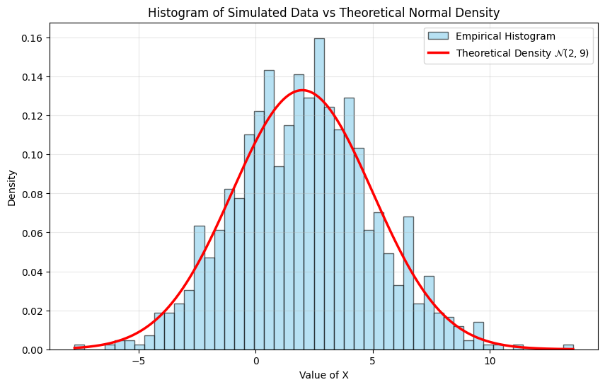
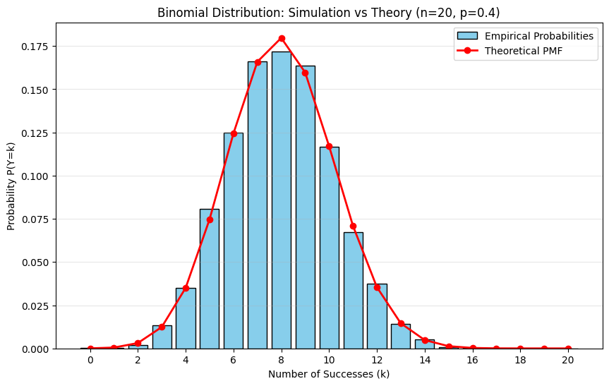

# TP4- Probability Distributions and Simulation

## Instructions

In this practical session, you will use Python (NumPy, SciPy, Matplotlib) to simulate probability distributions, compute empirical statistics, and compare them with the theoretical values. Each exercise includes simulation tasks and interpretation questions.

## Exercise 1- Simulation of a Discrete Distribution and a Normal Distribution

Consider the following two random variables:

- A discrete random variable $X$ taking values $0, 1, 2$ with probabilities:

$$
P(X = 0) = 0.2, \quad P(X = 1) = 0.5, \quad P(X = 2) = 0.3
$$

- A continuous random variable $Z$ following a standard normal distribution:

$$
Z \sim \mathcal{N}(0, 1)
$$

1. Simulate $n = 10 000$ realizations of $X$ and $Z$ in Numpy.

2. Estimate the empirical probabilities $\hat{P}(X = k)$ for $k = 0, 1, 2$ and compare them with the theoretical probabilities.

3. Estimate emprically the probability $$P(-1 \leq Z \leq 1)$$ and compare it with the theoretical probability $$P(-1 \leq Z \leq 1) = \phi(1) - \phi(-1),$$ where $\phi$ is the cumulative distribution function of the standard normal distribution.

### Solution

```python
import numpy as np
import scipy.stats as stats

# 1. Setup and Simulation
np.random.seed(42)  # For reproducible results
n = 10000

# --- Discrete Variable X ---
# Values and their probabilities
values_X = [0, 1, 2]
probs_X = [0.2, 0.5, 0.3]

# Simulate n realizations using random.choice
X_sim = np.random.choice(values_X, size=n, p=probs_X)

# --- Continuous Variable Z ---
# Simulate n realizations of standard normal distribution
Z_sim = np.random.normal(loc=0, scale=1, size=n)


# 2. Analysis of X (Discrete)
print("--- Analysis of X (Discrete) ---")
unique, counts = np.unique(X_sim, return_counts=True)
empirical_probs_X = counts / n

for val, prob_emp, prob_theo in zip(values_X, empirical_probs_X, probs_X):
    error = abs(prob_emp - prob_theo)
    print(
        f"P(X={val}): Empirical = {prob_emp:.4f} | Theoretical = {prob_theo:.4f} | Error = {error:.4f}"
    )


# 3. Analysis of Z (Continuous)
print("\n--- Analysis of Z (Continuous) ---")
# Calculate Empirical Probability: Proportion of Z values between -1 and 1
count_in_range = np.sum((Z_sim >= -1) & (Z_sim <= 1))
empirical_prob_Z = count_in_range / n

# Calculate Theoretical Probability: Phi(1) - Phi(-1)
# stats.norm.cdf is the Cumulative Distribution Function (Phi)
theoretical_prob_Z = stats.norm.cdf(1) - stats.norm.cdf(-1)
error_Z = abs(empirical_prob_Z - theoretical_prob_Z)

print(f"P(-1 <= Z <= 1):")
print(f"Empirical  = {empirical_prob_Z:.4f}")
print(f"Theoretical= {theoretical_prob_Z:.4f}")
print(f"Error      = {error_Z:.4f}")
```

#### Output

```plaintext
--- Analysis of X (Discrete) ---
P(X=0): Empirical = 0.2043 | Theoretical = 0.2000 | Error = 0.0043
P(X=1): Empirical = 0.5070 | Theoretical = 0.5000 | Error = 0.0070
P(X=2): Empirical = 0.2887 | Theoretical = 0.3000 | Error = 0.0113

--- Analysis of Z (Continuous) ---
P(-1 <= Z <= 1):
Empirical  = 0.6863
Theoretical= 0.6827
Error      = 0.0036
```

---

## Exercise 2- Empirical Mean and Density of a Normal Distribution

Let $X$ be a random variable following a normal distribution:

$$
X \sim \mathcal{N}(\mu, \sigma^2), \quad \mu = 2, \quad \sigma = 3
$$

1. Simulate $n = 1000$ realizations of $X$.

2. Compute the empirical mean $\hat{X}$ and empirical variance, then compare them to the theoretical values $\mu = 2$ and $\sigma^2 = 9$.

3. Plot the normalized histogram of the simulated data and superimpose the theoretical density of the normal distribution $\mathcal{N}(2, 9)$.

### Solution

```python
import numpy as np
import matplotlib.pyplot as plt
import scipy.stats as stats

# 1. Setup and Simulation
np.random.seed(42)  # For reproducibility
n = 1000
mu = 2
sigma = 3  # Standard deviation (sqrt of variance 9)

# Simulate n realizations
# loc = mean, scale = standard deviation
X_sim = np.random.normal(loc=mu, scale=sigma, size=n)

# 2. Compute Empirical Statistics
empirical_mean = np.mean(X_sim)
empirical_var = np.var(X_sim) # Default ddof=0 is fine for large n, or use ddof=1 for unbiased
theoretical_var = sigma**2

print(f"--- Statistics for n={n} ---")
print(f"Theoretical Mean:     {mu}")
print(f"Empirical Mean:       {empirical_mean:.4f}")
print(f"Difference:           {abs(empirical_mean - mu):.4f}")
print("-" * 30)
print(f"Theoretical Variance: {theoretical_var}")
print(f"Empirical Variance:   {empirical_var:.4f}")
print(f"Difference:           {abs(empirical_var - theoretical_var):.4f}")

# 3. Visualization: Histogram vs Theoretical Density
plt.figure(figsize=(10, 6))

# Plot the normalized histogram of the simulated data
# density=True ensures the y-axis represents probability density, not raw counts
plt.hist(X_sim, bins=50, density=True, alpha=0.6, color='skyblue', edgecolor='black', label='Empirical Histogram')

# Plot the Theoretical Density Function (PDF)
# Generate x-values covering the range of our data for a smooth curve
x_vals = np.linspace(min(X_sim), max(X_sim), 1000)
pdf_vals = stats.norm.pdf(x_vals, loc=mu, scale=sigma)

plt.plot(x_vals, pdf_vals, color='red', linewidth=2.5, label=r'Theoretical Density $\mathcal{N}(2, 9)$')

plt.title('Histogram of Simulated Data vs Theoretical Normal Density')
plt.xlabel('Value of X')
plt.ylabel('Density')
plt.legend()
plt.grid(True, alpha=0.3)
plt.show()
```

#### Output

```plaintext
--- Statistics for n=1000 ---
Theoretical Mean:     2
Empirical Mean:       2.0580
Difference:           0.0580
------------------------------
Theoretical Variance: 9
Empirical Variance:   8.6211
Difference:           0.3789
```



---

## Exercise 3- Binomial Distribution: Simulation vs. Theory

Let $Y$ be a binomial random variable:

$$
Y \sim \mathcal{B}(n, p), \quad n=20, \quad p=0.4
$$

1. Recall the theoretical formulas for the expectation and variance of a binomial distribution: $$E[Y] = np, \quad Var(Y) = np(1-p).$$

2. Simulate $N = 5\ 000$ realizations of $Y$.

3. Compute the empirical mean and empirical variance, and compare them with the theoretical values.

4. Estimate empirically the probabilities $\hat{P}(Y=k)$ for $k=0, 1, ..., 20$.

5. Plot on the same graph:

- a bar chart of the empirical probabilities,
- the theoretical PMF of the binomial distribution.

Comment on the accuracy of the empirical approximation.

### Solution

```python
import numpy as np
import matplotlib.pyplot as plt
import scipy.stats as stats

# (a) Theoretical Calculations
n = 20
p = 0.4
theoretical_mean = n * p
theoretical_var = n * p * (1 - p)

print("--- Theoretical Values ---")
print(f"Expectation E[Y]: {theoretical_mean}")
print(f"Variance Var(Y):  {theoretical_var:.2f}")

# (b) Simulation
np.random.seed(42) # For reproducibility
N = 5000
# Simulate N realizations of Binomial distribution B(n, p)
Y_sim = np.random.binomial(n=n, p=p, size=N)

# (c) Empirical Statistics
empirical_mean = np.mean(Y_sim)
empirical_var = np.var(Y_sim)

print("\n--- Empirical Statistics (N=5000) ---")
print(f"Empirical Mean:     {empirical_mean:.4f}")
print(f"Empirical Variance: {empirical_var:.4f}")
print(f"Difference (Mean):  {abs(empirical_mean - theoretical_mean):.4f}")
print(f"Difference (Var):   {abs(empirical_var - theoretical_var):.4f}")

# (d) Empirical Probabilities vs (e) Visualization
# Calculate counts for each value k from 0 to 20
# We use bins from -0.5 to 20.5 to center bars on integers
bins = np.arange(-0.5, n + 1.5, 1)

plt.figure(figsize=(10, 6))

# Plot Empirical Probabilities (Histogram)
# density=True normalizes the histogram so the sum of bar areas equals 1
# This approximates P(Y=k) since width=1
plt.hist(Y_sim, bins=bins, density=True, rwidth=0.8, color='skyblue', edgecolor='black', label='Empirical Probabilities')

# Plot Theoretical PMF
k_values = np.arange(0, n + 1)
theoretical_probs = stats.binom.pmf(k_values, n, p)

plt.plot(k_values, theoretical_probs, 'ro-', linewidth=2, markersize=6, label='Theoretical PMF')

plt.title(f'Binomial Distribution: Simulation vs Theory (n={n}, p={p})')
plt.xlabel('Number of Successes (k)')
plt.ylabel('Probability P(Y=k)')
plt.xticks(np.arange(0, n+1, 2)) # Show tick every 2 integers
plt.legend()
plt.grid(axis='y', alpha=0.3)
plt.show()
```

#### Output

```plaintext
--- Theoretical Values ---
Expectation E[Y]: 8.0
Variance Var(Y):  4.80

--- Empirical Statistics (N=5000) ---
Empirical Mean:     7.9750
Empirical Variance: 4.8136
Difference (Mean):  0.0250
Difference (Var):   0.0136
```


