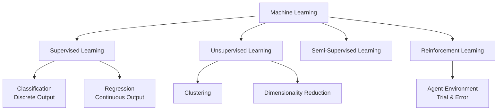
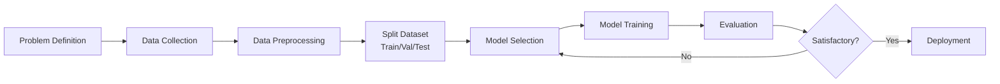
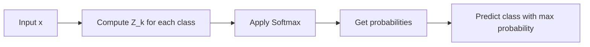
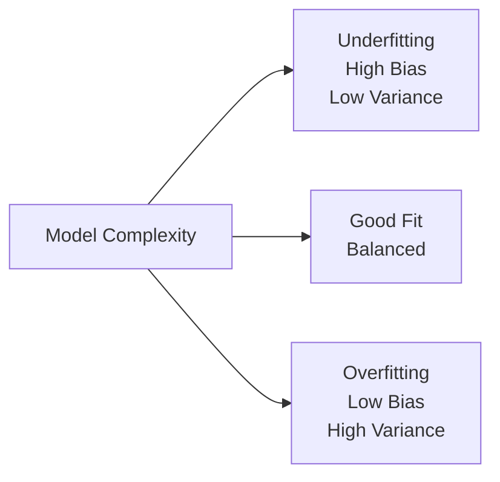
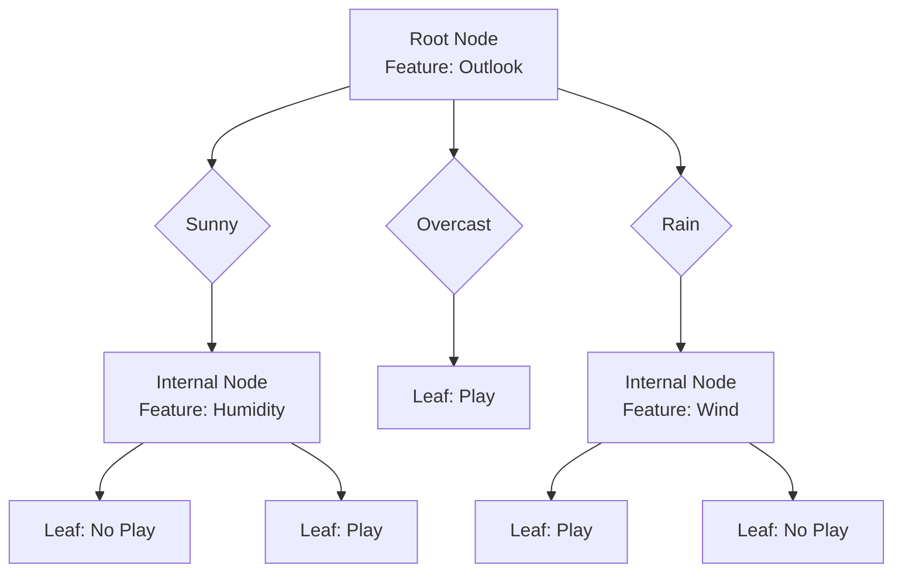
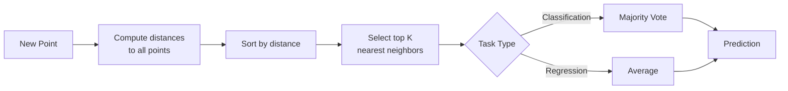
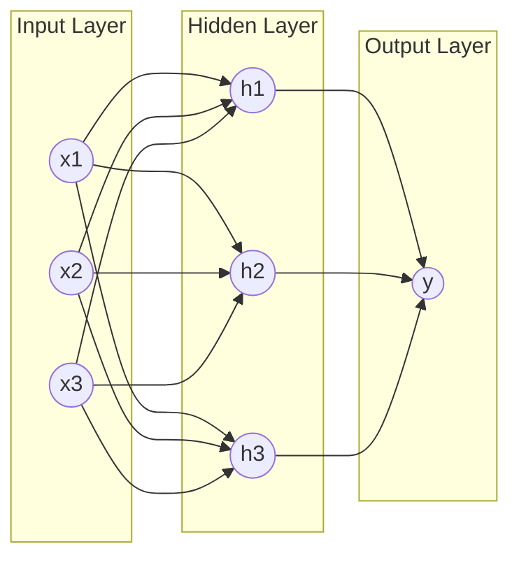
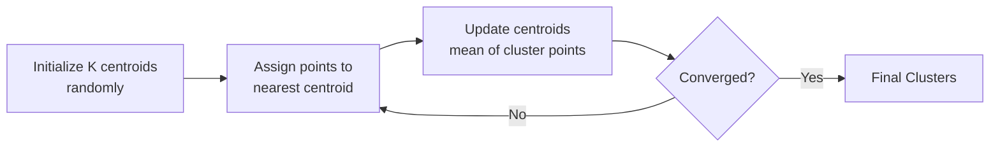
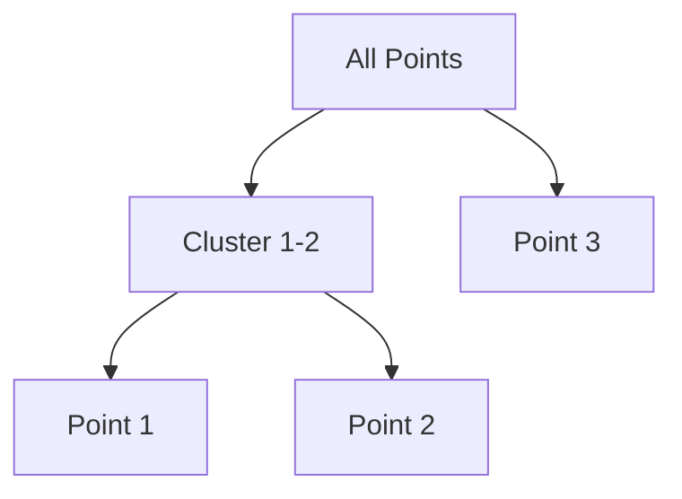

# Machine Learning Course Summary

## 1. Introduction to Machine Learning

### Types of ML

**🎯 Supervised Learning:** Learning from inputs $x$ to output $y$ given **labeled data**

- **Classification:** Output is discrete (e.g., spam/not spam)
- **Regression:** Output is continuous (e.g., house prices)

**🔍 Unsupervised Learning:** Uses **unlabeled data** to find groups, clusters, or patterns

**🔄 Semi-supervised Learning:** Uses a **small amount of labeled data** + **large amount of unlabeled data**

**🎮 Reinforcement Learning:** Learning through **trial and error** (agent-state-action-reward-environment)

### ML Algorithms & Workflow

**Common Algorithms:** Linear regression, logistic regression, decision trees, KNN, Naïve Bayes, Neural Networks

**Workflow:**

1. **Problem definition** — What are we predicting?
2. **Data collection** — Gather relevant data
3. **Data preprocessing** — Clean, normalize, handle missing values
4. **Split dataset** — Training (60-70%), Validation (10-20%), Testing (10-20%)
5. **Model selection** — Choose appropriate algorithm
6. **Model training** — Fit model to training data
7. **Evaluation** — Measure performance on validation/test data

## 2. Linear Regression

### Univariate Linear Regression

**Model:** $h(X) = \theta_0 + \theta_1 X$

**📊 Cost Function (MSE):** Measures the average squared difference between predicted and actual values

$$J(\theta_0, \theta_1) = \frac{1}{2m} \sum_{i=1}^{m} [h_\theta(x^{(i)}) - y^{(i)}]^2$$

**⚡ Gradient Descent:** Algorithm to minimize the cost function by repeating until convergence

$$\theta_j = \theta_j - \alpha \frac{\partial J(\theta_0, \theta_1)}{\partial \theta_j}$$

- $\alpha$ is the **learning rate** (controls step size)
- ⚠️ Update $\theta_0$ and $\theta_1$ **simultaneously**

**Partial Derivatives:**

$$
\begin{align*}
\frac{\partial J}{\partial \theta_0} &= \frac{1}{m} \sum_{i=1}^{m} (h_\theta(x^{(i)}) - y^{(i)}) \\
\frac{\partial J}{\partial \theta_1} &= \frac{1}{m} \sum_{i=1}^{m} (h_\theta(x^{(i)}) - y^{(i)}) \cdot x^{(i)}
\end{align*}
$$

### Multivariate Linear Regression

Involves **multiple independent variables** (features)

**Hypothesis:** $h_\theta(x) = \theta^T x = \theta_0 + \theta_1 x_1 + ... + \theta_n x_n$

**Gradient Descent (Vectorized):**

$$\theta = \theta - \frac{\alpha}{m} X^T (X\theta - y)$$

**📏 Feature Scaling:** Recommended so features are on the **same scale** for faster convergence

- Divide by max or range (max - min)
- Get features roughly in range $[-1, 1]$

**Mean Normalization:** Replace $x_i$ with $\frac{x_i - \mu_i}{\sigma_i}$ (where $\mu$ is mean and $\sigma$ is standard deviation)

**🎯 Normal Equation (Direct Solution):**

$$\theta = (X^T X)^{-1} X^T Y$$

| Gradient Descent | Normal Equation |
|------------------|----------------|
| Need to choose $\alpha$ | No need for $\alpha$ |
| Needs many iterations | No iterations |
| Works well for large $n$ | Slow if $n$ is very large |
| $O(kn^2)$ | $O(n^3)$ for matrix inversion |

### Polynomial Regression

Models **non-linear relationships** as an $n$-th degree polynomial

$$h_\theta(x) = \theta_0 + \theta_1 x + \theta_2 x^2 + ... + \theta_n x^n$$

⚠️ **Feature scaling becomes critical** for polynomial regression!

## 3. Logistic Regression (Classification)

Used to predict the **probability** of a binary (0 or 1) or multi-class outcome

### Binary Classification

**🔵 Sigmoid Function:** Maps output between 0 and 1

$$g(Z) = \frac{1}{1 + e^{-Z}} = \frac{1}{1 + e^{-\theta^T x}}$$

**Key Properties:**

- $g(0) = 0.5$
- $\lim_{z \to \infty} g(z) = 1$
- $\lim_{z \to -\infty} g(z) = 0$

**Decision Rule:**

- If $g(Z) \ge 0.5$ ⟺ $\theta^T x \ge 0$, predict **class 1**
- If $g(Z) < 0.5$ ⟺ $\theta^T x < 0$, predict **class 0**

**📉 Cost Function (Log Loss):**

$$L(\hat{y}, y) = \begin{cases} - \ln(\hat{y}) & \text{if } y=1 \\ - \ln(1-\hat{y}) & \text{if } y=0 \end{cases}$$

**Cross-Entropy Loss (dataset):**

$$J(\hat{y}, y) = -\frac{1}{m} \sum_{i=1}^{m} [y^{(i)} \ln(\hat{y}^{(i)}) + (1-y^{(i)}) \ln(1-\hat{y}^{(i)})]$$

**Gradient Descent Update:**

$$\theta_j := \theta_j - \alpha \frac{1}{m} \sum_{i=1}^{m} (h_\theta(x^{(i)}) - y^{(i)}) x_j^{(i)}$$

⚠️ Same form as linear regression, but $h_\theta(x) = g(\theta^T x)$ is different!

### Multiclass Classification

For $K$ classes:

1. Compute linear score $Z_k$ for each class
2. Exponentiate $e^{Z_k}$
3. Compute probability (**Softmax**):

$$p(y=k|x) = \frac{e^{Z_k}}{\sum_{j=0}^{n} e^{Z_j}}$$

1. Prediction is the class with **max probability**

**Cross-Entropy Loss (Multiclass):**

$$J(\hat{y}, y) = -\frac{1}{m} \sum_{i=1}^{m} \sum_{k=0}^{K-1} y_k \ln(\hat{y}_k)$$

## 4. Model Evaluation & Challenges

### Bias vs. Variance

**🎯 Bias:** Inability to capture the true relationship (Model **too simple** → **Underfitting**)

**📊 Variance:** Inconsistency when applied to different datasets (Model **too complex** → **Overfitting**)

**Error Decomposition:**

$$\text{Error} = \text{Bias}^2 + \text{Variance} + \text{Irreducible Errors}$$

### Overfitting Prevention

**Data Manipulation:**

- ✅ Splitting (Train/Val/Test)
- ✅ Resampling
- ✅ Augmenting (rotation, scaling, flipping)
- ✅ Reducing features (feature selection)

**🔒 Regularization:** Adds a penalty to the loss function

- **L1 (Lasso):** Adds $\lambda \sum |w_i|$ → Encourages **sparsity** (some weights → 0)
- **L2 (Ridge):** Adds $\lambda \sum w_i^2$ → Encourages **small weights**

**Dropout:** Randomly drop units (neurons) during training

**Early Stopping:** Stop when validation accuracy starts to decrease

### Classification Metrics

**Confusion Matrix:**

|  | Predicted Positive | Predicted Negative |
|---|---|---|
| **Actual Positive** | TP (True Positive) | FN (False Negative) |
| **Actual Negative** | FP (False Positive) | TN (True Negative) |

**Key Metrics:**

| Metric | Formula | Meaning |
|--------|---------|---------|
| **Accuracy** | $\frac{TP + TN}{\text{Total}}$ | Overall correctness |
| **Recall (TPR)** | $\frac{TP}{TP + FN}$ | Coverage of actual positives |
| **Specificity (TNR)** | $\frac{TN}{FP + TN}$ | Coverage of actual negatives |
| **Precision** | $\frac{TP}{TP + FP}$ | Accuracy of positive predictions |
| **F-Score** | $\frac{(1+\beta^2)(P \times R)}{\beta^2 \cdot P + R}$ | Harmonic mean of P & R |

**F1-Score** (when $\beta = 1$):

$$F_1 = \frac{2 \times \text{Precision} \times \text{Recall}}{\text{Precision} + \text{Recall}}$$

**📈 ROC Curve:** Plots TPR vs FPR

- **AUC ≈ 1** → Perfect classifier
- **AUC ≈ 0.5** → Random guessing
- **AUC < 0.5** → Worse than random

## 5. Decision Trees

### Components

- **🌳 Root node:** Starting point (top of tree)
- **🔀 Internal nodes:** Decisions based on features
- **🍃 Leaf nodes:** Final class labels/values (predictions)

### Process

1. **Select** best splitting attribute (using splitting criteria)
2. **Create** branches for each value
3. **Recursively grow** subtrees until stopping condition
4. **Prune** if necessary to avoid overfitting

### Splitting Criteria

**ID3 (Information Gain/Entropy):**

- Choose attribute with **highest Information Gain** (IG)
- $IG = E(\text{Parent}) - \sum \frac{|D_i|}{|D|} E(D_i)$
- **Entropy:** $H(D) = - \sum P_i \log_2 P_i$
  - Low entropy → High purity (homogeneous)
  - High entropy → Low purity (mixed)

**C4.5 (Gain Ratio):**

$$GR = \frac{IG}{\text{Split Info}}$$

Normalizes Information Gain to handle bias towards attributes with many values

**CART (Gini Index):** Used for classification

$$GI = 1 - \sum P_i^2$$

- Measures impurity
- Range: [0, 0.5] (0 = pure, 0.5 = maximum impurity)

**Regression Trees:** Use **Mean Squared Error (MSE) reduction** to choose splits

| Criterion | Best For | Range |
|-----------|----------|-------|
| Entropy | ID3, C4.5 | [0, 1] |
| Gini Index | CART (faster) | [0, 0.5] |
| MSE | Regression Trees | [0, ∞) |

## 6. K-Nearest Neighbors (K-NN)

Predicts class/value based on the **$K$ most similar** stored samples

### Steps

1. **Compute** distance between new point and all training points
2. **Sort** by distance and select top $K$ neighbors
3. **Aggregate:**
   - Classification → **Majority vote**
   - Regression → **Average** (or weighted average)

### Distance Metrics

| Metric | Formula | Use Case |
|--------|---------|----------|
| **Euclidean** | $d = \sqrt{\sum (x_i - x_i')^2}$ | Default, measures straight-line distance |
| **Manhattan** | $d = \sum \|x_i - x_i'\|$ | Grid-like paths, robust to outliers |
| **Minkowski** | $d = (\sum \|x_i - x_i'\|^p)^{1/p}$ | General form ($p=1$ Manhattan, $p=2$ Euclidean) |

**⚖️ Weighted K-NN:** Weights neighbors by **inverse distance** ($w_i = 1/d_i^2$)

- Closer neighbors have more influence

**Choosing K:**

- ✅ Small $K$ → More sensitive to noise (overfitting)
- ✅ Large $K$ → Smoother boundaries (underfitting)
- 📊 Use **cross-validation** to find optimal $K$
- 🔢 Often use **odd $K$** for binary classification (avoid ties)

## 7. Naïve Bayes

A **probabilistic classifier** based on Bayes' Theorem, assuming **independence** between features

### Bayes' Theorem

$$P(H|D) = \frac{P(D|H) \times P(H)}{P(D)}$$

**Components:**

- $P(H|D)$: **Posterior** — Probability of hypothesis after seeing data
- $P(D|H)$: **Likelihood** — Probability of data given hypothesis
- $P(H)$: **Prior** — Initial probability of hypothesis
- $P(D)$: **Evidence** — Probability of data (normalizing constant)

**🔑 Naïve Assumption:** All features are **conditionally independent** given the class

$$P(x_1, x_2, ..., x_n | C) = P(x_1|C) \times P(x_2|C) \times ... \times P(x_n|C)$$

**Classification Rule:**

$$\hat{y} = \arg\max_c P(C=c) \prod_{i=1}^{n} P(x_i | C=c)$$

### Laplace Smoothing

Used if a feature value **never appears** in a class to avoid **zero probability**

$$P(x_i|C) = \frac{N_{ic} + 1}{N_c + K}$$

- $N_{ic}$: Count of feature $x_i$ in class $C$
- $N_c$: Total count of all features in class $C$
- $K$: Number of distinct values for feature $x_i$

**Why needed?** If $P(x_i|C) = 0$, entire product becomes 0!

## 8. Neural Networks

### Structure

- **Input Layer:** Represents features ($x_1, x_2, ..., x_n$)
- **Hidden Layers:** Between input and output (can be multiple)
- **Output Layer:** Produces prediction ($\hat{y}$)

### Node Computation

**Linear Combination:**

$$Z = \sum_{i=1}^{n} w_i x_i + b = W^T X + b$$

**Activation:**

$$a = f(Z)$$

where $f$ is the **activation function**

### Activation Functions

| Function | Formula | Range | Use Case |
|----------|---------|-------|----------|
| **Sigmoid** | $\sigma(z) = \frac{1}{1+e^{-z}}$ | (0, 1) | Binary classification (output) |
| **Tanh** | $\tanh(z) = \frac{e^z - e^{-z}}{e^z + e^{-z}}$ | (-1, 1) | Hidden layers (zero-centered) |
| **ReLU** | $\text{ReLU}(z) = \max(0, z)$ | [0, ∞) | **Most common** for hidden layers |
| **Leaky ReLU** | $\max(0.01z, z)$ | (-∞, ∞) | Fixes "dying ReLU" problem |
| **Softmax** | $\frac{e^{z_i}}{\sum e^{z_j}}$ | (0, 1), sum=1 | Multiclass classification |

### Training

**🔄 Backpropagation:** Propagates error backwards to update weights

1. **Forward pass:** Compute predictions
2. **Calculate loss:** Compare with true labels
3. **Backward pass:** Compute gradients using chain rule
4. **Update weights:** Adjust parameters

**Weight Update:**

$$w_{\text{new}} = w_{\text{old}} - \eta \frac{\partial L}{\partial w}$$

where $\eta$ is the **learning rate**

### Training Strategies (Gradient Descent)

| Strategy | Batch Size | Speed | Memory | Convergence |
|----------|------------|-------|--------|-------------|
| **Stochastic GD (SGD)** | 1 | Fast per update | Low | Noisy |
| **Batch GD** | All $m$ samples | Slow per update | High | Smooth |
| **Mini-batch GD** | $k$ samples (32-256) | **Balanced** | Medium | **Most common** |

**🎯 Mini-batch GD** is the **sweet spot** — combines benefits of both!

## 9. Clustering

**Unsupervised learning** — Grouping similar data points based on **similarity/distance**

### K-Means Clustering

Partitions $n$ points into $K$ clusters by **minimizing variance within clusters**

**🎯 Objective:** Minimize Within-Cluster Sum of Squares (WCSS)

$$J = \sum_{i=1}^{K} \sum_{x \in C_i} ||x - \mu_i||^2$$

- $\mu_i$: Centroid of cluster $i$
- $C_i$: Set of points in cluster $i$

**Algorithm Steps:**

1. **Initialize:** Randomly select $K$ initial centroids
2. **Assignment:** Assign each point to nearest centroid
3. **Update:** Recalculate centroids as mean of assigned points
4. **Repeat:** Steps 2-3 until assignments stabilize (or max iterations)

**Choosing K:**

📊 **Elbow Method:**

- Plot WCSS vs $K$
- Look for "elbow" where decrease slows
- Trade-off between fit and complexity

📏 **Silhouette Score:**

- Measures **cohesion** (within-cluster) vs **separation** (between-cluster)
- Range: **[-1, 1]**
  - 1 → Perfect clustering
  - 0 → Overlapping clusters
  - -1 → Misclassified points

$$s(i) = \frac{b(i) - a(i)}{\max(a(i), b(i))}$$

- $a(i)$: Avg distance to points in same cluster
- $b(i)$: Avg distance to points in nearest other cluster

### Hierarchical Clustering

Produces a **tree-like diagram** called a **Dendrogram**

**🌳 Agglomerative (Bottom-up):**

1. Start with each point as its **own cluster**
2. **Merge** closest two clusters based on distance matrix
3. **Update** distance matrix using linkage criteria
4. **Repeat** until one cluster remains (or desired $K$ clusters)

**Linkage Criteria:**

| Method | Distance Between Clusters | Characteristics |
|--------|---------------------------|-----------------|
| **Single** | Min distance between any two points | Sensitive to outliers, chain effect |
| **Complete** | Max distance between any two points | Less sensitive to outliers, compact clusters |
| **Average** | Average distance between all pairs | Balanced approach |
| **Ward's** | Minimizes within-cluster variance | Produces even-sized clusters |

**Advantages:**

- ✅ No need to specify $K$ in advance
- ✅ Visual dendrogram for interpretation
- ✅ Captures hierarchical structure

**Disadvantages:**

- ❌ Computationally expensive: $O(n^2 \log n)$ or $O(n^3)$
- ❌ Cannot undo merges (greedy algorithm)

---

## 📋 Quick Reference Cheatsheet

### Algorithms Comparison

| Algorithm | Type | Pros | Cons | Use Case |
|-----------|------|------|------|----------|
| **Linear Regression** | Regression | Simple, interpretable, fast | Assumes linearity | Continuous output, linear relationships |
| **Logistic Regression** | Classification | Probabilistic output, interpretable | Linear decision boundary | Binary/multiclass classification |
| **Decision Trees** | Both | Non-linear, interpretable, no scaling | Overfitting, unstable | Complex decision boundaries |
| **K-NN** | Both | Simple, no training | Slow prediction, sensitive to $K$ | Small datasets, non-linear |
| **Naïve Bayes** | Classification | Fast, works with small data | Independence assumption | Text classification, spam detection |
| **Neural Networks** | Both | Powerful, learns complex patterns | Black box, needs large data | Image, text, complex patterns |
| **K-Means** | Clustering | Fast, scalable | Need to specify $K$, sensitive to init | Customer segmentation |
| **Hierarchical** | Clustering | No need for $K$, dendrogram | Slow, not scalable | Taxonomy, small datasets |

### Key Formulas

| Concept | Formula | Notes |
|---------|---------|-------|
| **Linear Hypothesis** | $h_\theta(x) = \theta^T x$ | $x_0 = 1$ for bias |
| **MSE Cost** | $J = \frac{1}{2m} \sum (h_\theta(x^{(i)}) - y^{(i)})^2$ | Factor of $\frac{1}{2}$ simplifies derivative |
| **Gradient Descent** | $\theta_j := \theta_j - \alpha \frac{\partial J}{\partial \theta_j}$ | Update **simultaneously** |
| **Normal Equation** | $\theta = (X^T X)^{-1} X^T Y$ | Direct solution, $O(n^3)$ |
| **Sigmoid** | $g(z) = \frac{1}{1+e^{-z}}$ | Maps to (0, 1) |
| **Cross-Entropy** | $J = -\frac{1}{m} \sum [y \log(\hat{y}) + (1-y) \log(1-\hat{y})]$ | Logistic regression loss |
| **Softmax** | $p_k = \frac{e^{z_k}}{\sum_j e^{z_j}}$ | Multiclass probabilities |
| **Entropy** | $H(D) = -\sum P_i \log_2 P_i$ | Decision tree splitting |
| **Gini Index** | $GI = 1 - \sum P_i^2$ | Alternative to entropy |
| **Euclidean Distance** | $d = \sqrt{\sum (x_i - x_i')^2}$ | K-NN default metric |
| **Bayes' Theorem** | $P(H\|D) = \frac{P(D\|H) P(H)}{P(D)}$ | Naïve Bayes foundation |

### Evaluation Metrics

| Metric | Formula | When to Use |
|--------|---------|-------------|
| **Accuracy** | $\frac{TP+TN}{Total}$ | Balanced classes |
| **Precision** | $\frac{TP}{TP+FP}$ | Minimize false positives (spam detection) |
| **Recall** | $\frac{TP}{TP+FN}$ | Minimize false negatives (disease detection) |
| **F1-Score** | $\frac{2 \times P \times R}{P+R}$ | Imbalanced classes, balance P & R |
| **MSE** | $\frac{1}{m}\sum(y-\hat{y})^2$ | Regression |
| **MAE** | $\frac{1}{m}\sum\|y-\hat{y}\|$ | Regression, robust to outliers |
| **R²** | $1 - \frac{SS_{res}}{SS_{tot}}$ | Regression, % variance explained |

### Hyperparameters

| Algorithm | Hyperparameter | Typical Values | Impact |
|-----------|---------------|----------------|--------|
| **All GD** | Learning rate $\alpha$ | 0.001, 0.01, 0.1, 1 | Speed & convergence |
| **Regularization** | $\lambda$ | 0.01, 0.1, 1, 10 | Overfitting control |
| **K-NN** | $K$ neighbors | 3, 5, 7, 11 (odd) | Bias-variance tradeoff |
| **Decision Tree** | Max depth | 3-10 | Overfitting control |
| **Neural Network** | Hidden layers | 1-5+ | Model complexity |
| **Neural Network** | Neurons per layer | 32, 64, 128, 256 | Representational power |
| **K-Means** | $K$ clusters | Use elbow/silhouette | Number of groups |
| **Mini-batch GD** | Batch size | 32, 64, 128, 256 | Memory vs convergence |

### Feature Preprocessing

| Technique | Formula | Purpose |
|-----------|---------|---------|
| **Min-Max Scaling** | $\frac{x - \min}{\max - \min}$ | Scale to [0, 1] |
| **Standardization** | $\frac{x - \mu}{\sigma}$ | Mean=0, Std=1 (preferred for GD) |
| **Normalization** | $\frac{x}{\\|x\\|}$ | Scale to unit norm |

### Model Selection Guide

**Choose based on:**

1. **Data size:** Small → K-NN, Naïve Bayes; Large → Neural Networks
2. **Interpretability needed:** Decision Trees, Linear/Logistic Regression
3. **Output type:** Continuous → Regression; Discrete → Classification
4. **Linearity:** Linear → Linear models; Non-linear → Trees, NN, K-NN
5. **Training speed:** Fast → Naïve Bayes, Linear; Slow → Neural Networks
6. **Prediction speed:** Fast → Linear, Trees; Slow → K-NN

---

**💡 Key Takeaways:**

- Always **split data** (train/val/test) to avoid overfitting
- **Feature scaling** improves gradient descent convergence
- **Regularization** helps prevent overfitting
- Choose **metrics** based on problem (accuracy vs precision vs recall)
- **Cross-validation** for reliable model selection
- Start **simple**, add complexity only if needed
