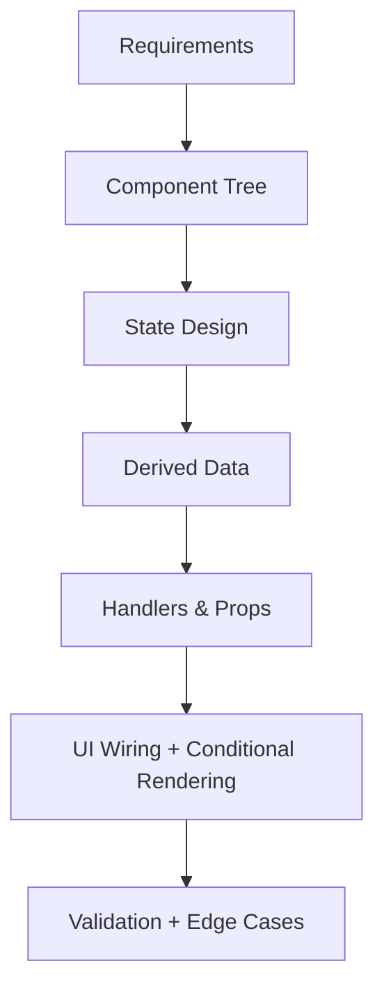
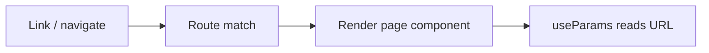
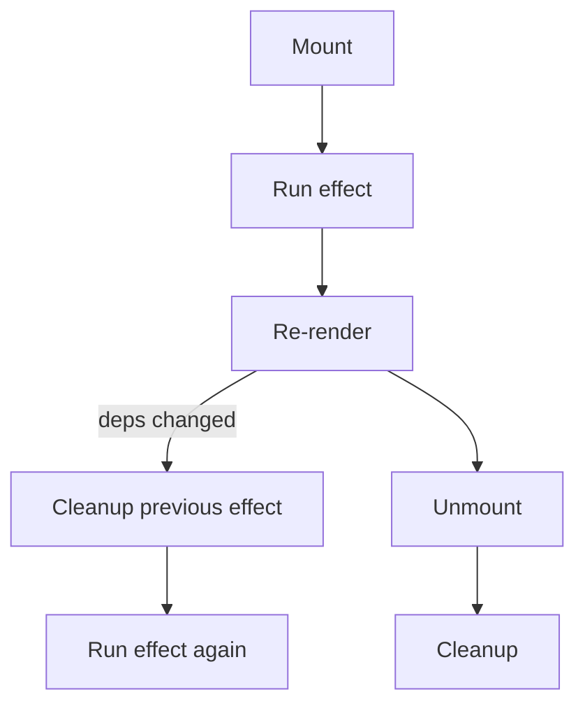

# IN432 React Cheat Sheet (Exam-Oriented)

## Overview

This cheat sheet summarizes the React topics used in this course (Vite setup, JSX/components, state/props/events, forms, router, and core hooks). It’s designed as an **exam playbook**: what to build first, which patterns to apply, and the most common snippets you’ll rewrite under time pressure.

## Exam Workflow (What to do first)

- **1) Read the statement → extract requirements**
  - Inputs: user actions (click, type, filter, navigate)
  - Outputs: UI screens/components + what changes on interaction
  - Data: entities + fields (e.g., product, workshop, cart item)
- **2) Sketch the UI + component tree**
  - Identify repeated UI → make a component
  - Decide where state should live (usually the lowest common parent)
- **3) Define state, derived data, handlers**
  - State = what changes (arrays, form values, toggles)
  - Derived = computed from state (`filter`, `map`, `reduce`) → do NOT store if you can compute
  - Handlers = functions that update state (often passed down as props)
- **4) Implement in this order**
  - Render static layout → map lists → add event handlers → add state updates → add conditional rendering → polish validation



## Vite + Project Structure (fast recall)

- Create project
  - `npm create vite@latest my-app -- --template react`
  - `cd my-app && npm install && npm run dev`
- Structure (course uses Vite)
  - `index.html` at project root, entry is `/src/main.jsx`
  - Typical files
    - `src/main.jsx` → React root
    - `src/App.jsx` (or `App.js`) → main component

## JSX Essentials

- JSX rules
  - Must return **one parent** element (use `<>...</>` fragment if needed)
  - Use `{}` for JS expressions
  - `className`, `htmlFor`, camelCase events: `onClick`, `onChange`
- Conditional rendering patterns
  - Ternary: `{ok ? <A/> : <B/>}`
  - AND: `{ok && <A/>}`
  - Empty state: `{list.length === 0 ? <p>Empty</p> : <List/>}`

## Components (Function components)

- Minimal template

```jsx
function ComponentName({ someProp, onAction }) {
 return (
  <div>
   <button onClick={onAction}>Do</button>
   <p>{someProp}</p>
  </div>
 );
}

export default ComponentName;
```

## Props (Passing data + callbacks)

- Use destructuring in function signature

```jsx
function ProductCard({ id, name, price, onAddToCart }) {
 return <button onClick={() => onAddToCart(id)}>Add</button>;
}
```

- **Rule of thumb**
  - Parent owns state
  - Child receives data + emits events upward via callback props

## State (useState)

- Common patterns
  - Primitive: `const [count, setCount] = useState(0)`
  - Boolean toggle: `setOpen(prev => !prev)`
  - Array add: `setItems(prev => [...prev, newItem])`
  - Array remove: `setItems(prev => prev.filter((_, i) => i !== index))`
  - Object update (preserve other fields):

```jsx
setForm(prev => ({ ...prev, email: value }));
```

- Functional updates (important in exams)
  - Use when next state depends on previous state

```jsx
setCount(prev => prev + 1);
```

## Events (onClick/onChange/onSubmit)

- Prevent default form submit

```jsx
const handleSubmit = (e) => {
 e.preventDefault();
 // validate, then submit
};
```

- Pass arguments to handlers

```jsx
<button onClick={() => handleSelect(item.id)}>Select</button>
```

## Lists + Keys

- Render list

```jsx
{products.map(p => (
 <ProductCard key={p.id} {...p} onAddToCart={handleAddToCart} />
))}
```

- Key rule
  - Prefer stable IDs (`p.id`), avoid array index unless list is static

## Derived Data (filter/map/reduce) — common in labs/exams

- Search + category filter pattern

```jsx
const filtered = products.filter(p => {
 const matchesSearch = p.name.toLowerCase().includes(query.toLowerCase());
 const matchesCategory = category === 'All' || p.category === category;
 return matchesSearch && matchesCategory;
});
```

- Totals with `reduce`

```jsx
const total = cartItems.reduce((sum, item) => sum + item.price, 0);
```

- Find by id

```jsx
const product = products.find(p => p.id === productId);
```

## Forms (Controlled components + validation)

- Controlled input template

```jsx
const [form, setForm] = useState({ name: '', email: '' });

<input
 value={form.name}
 onChange={(e) => setForm(prev => ({ ...prev, name: e.target.value }))}
/>
```

- Checkbox

```jsx
<input
 type="checkbox"
 checked={form.accepted}
 onChange={(e) => setForm(prev => ({ ...prev, accepted: e.target.checked }))}
/>
```

- Select

```jsx
<select
 value={form.level}
 onChange={(e) => setForm(prev => ({ ...prev, level: e.target.value }))}
>
 <option value="beginner">Beginner</option>
 <option value="advanced">Advanced</option>
</select>
```

- Radio group

```jsx
<label>
 <input
  type="radio"
  name="mode"
  value="remote"
  checked={form.mode === 'remote'}
  onChange={(e) => setForm(prev => ({ ...prev, mode: e.target.value }))}
 />
 Remote
</label>
```

- Minimal validation checklist
  - Validate on submit (fastest in exams)
  - Store errors in state: `const [errors, setErrors] = useState({})`
  - Examples
    - name length: `name.trim().length >= 3`
    - email contains `@`

<!-- illustration: show a form with controlled inputs, errors under fields, and submit button disabled when invalid -->

## Styling (what you’ll likely use)

- Import CSS once
  - `import './App.css'`
- Conditional class names

```jsx
<div className={`workshop-card ${isSelected ? 'workshop-card--selected' : ''}`} />
```

- Inline style (ok for small tweaks)

```jsx
<div style={{ display: 'flex', gap: '1rem' }} />
```

## Router (react-router-dom)

- Core components seen in examples
  - `<BrowserRouter>` wraps app
  - `<Routes>` + `<Route path element={...} />`
  - `<Link to="...">` for navigation
  - `useParams()` for `/:id`
  - `useNavigate()` for programmatic navigation

```jsx
import { BrowserRouter, Routes, Route, Link, useParams, useNavigate } from 'react-router-dom';

function ProductDetail() {
 const { id } = useParams();
 const navigate = useNavigate();
 return (
  <div>
   <p>Product id: {id}</p>
   <button onClick={() => navigate('/products')}>Back</button>
  </div>
 );
}
```



## Hooks Rules (memorize)

- Hooks are called
  - Only in React function components (or custom hooks)
  - Only at top-level (not in loops/conditions)

## useEffect (side effects)

- Dependency array behavior

| Dependencies | When it runs | Typical use |
|---|---|---|
| none | after every render | rarely (debug) |
| `[]` | once on mount | initial fetch, setup |
| `[x]` | when `x` changes | sync derived side effect |

- Cleanup pattern (timers/listeners)

```jsx
useEffect(() => {
 const id = setInterval(() => setSeconds(s => s + 1), 1000);
 return () => clearInterval(id);
}, []);
```



## useContext (avoid prop drilling)

- Pattern
  - `const Ctx = createContext()`
  - Wrap subtree with `<Ctx.Provider value={...}>`
  - Consume with `useContext(Ctx)`

```jsx
import { createContext, useContext, useState } from 'react';

const ThemeContext = createContext();

function ThemeProvider({ children }) {
 const [theme, setTheme] = useState('light');
 return (
  <ThemeContext.Provider value={{ theme, setTheme }}>
   {children}
  </ThemeContext.Provider>
 );
}

function ThemedButton() {
 const { theme, setTheme } = useContext(ThemeContext);
 return <button onClick={() => setTheme(theme === 'light' ? 'dark' : 'light')}>Toggle</button>;
}
```

- Exam tip
  - Use context only if you truly have global-ish data (theme/auth/cart) used across many branches.

## useRef (DOM access + mutable values without re-render)

- Most common exam uses
  - Focus input
  - Store timer/interval id
  - Track previous value / render count

```jsx
const inputRef = useRef(null);

<input ref={inputRef} />
<button onClick={() => inputRef.current?.focus()}>Focus</button>
```

## Custom Hooks (reuse logic)

- When to make one
  - You copy/paste the same state + effect + handlers across components
- Patterns seen in examples
  - `useLocalStorage(key, initialValue)`
  - `useToggle(initial=false)`
  - `useDebounce(value, delay)`
  - `usePrevious(value)`

```jsx
function useToggle(initial = false) {
 const [value, setValue] = useState(initial);
 const toggle = () => setValue(v => !v);
 return [value, toggle];
}
```

## Common Exam Tasks → Quick Templates

### Task: “Selectable cards + highlight selected”

- State: `selectedId`
- Render: map cards
- Card gets `isSelected` + `onSelect(id)`

```jsx
const [selectedId, setSelectedId] = useState(null);

{items.map(item => (
 <Card
  key={item.id}
  item={item}
  isSelected={item.id === selectedId}
  onSelect={setSelectedId}
 />
))}
```

### Task: “Filter panel controls the list”

- Store filters object in parent
- Pass `filters` + `onFilterChange`
- Keep controls controlled

```jsx
const [filters, setFilters] = useState({
 showOnlyOpen: false,
 mode: 'all',
 focus: 'all'
});

const onFilterChange = (patch) => setFilters(prev => ({ ...prev, ...patch }));
```

### Task: “Cart / counter / derived total”

- Store `cartItems` array
- Derive `count` and `total` (or keep `count` if required)

```jsx
const [cartItems, setCartItems] = useState([]);
const count = cartItems.length;
const total = cartItems.reduce((sum, item) => sum + item.price, 0);
```

### Task: “Search input + list filtering”

```jsx
const [query, setQuery] = useState('');
<input value={query} onChange={(e) => setQuery(e.target.value)} />
```

## Debug Checklist (when it “doesn’t work”)

- UI not updating
  - Did you mutate state directly? (should create new array/object)
  - Are you using functional updates when needed?
- List rendering weird
  - Keys stable?
  - Mapping correct array (filtered vs original)?
- Form not typing
  - Missing `value` or `onChange`?
  - Using `checked` for checkbox?
- Effect infinite loop
  - Are you updating a dependency inside effect without dependency array?
